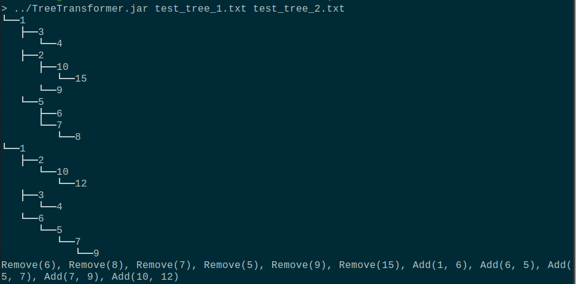
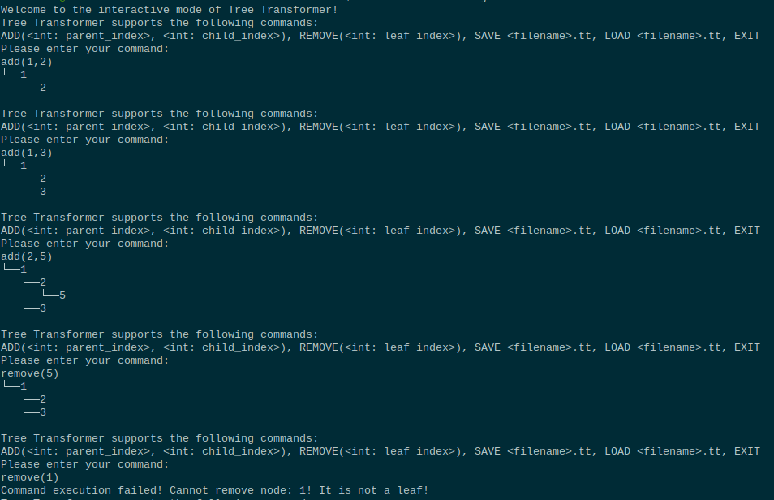
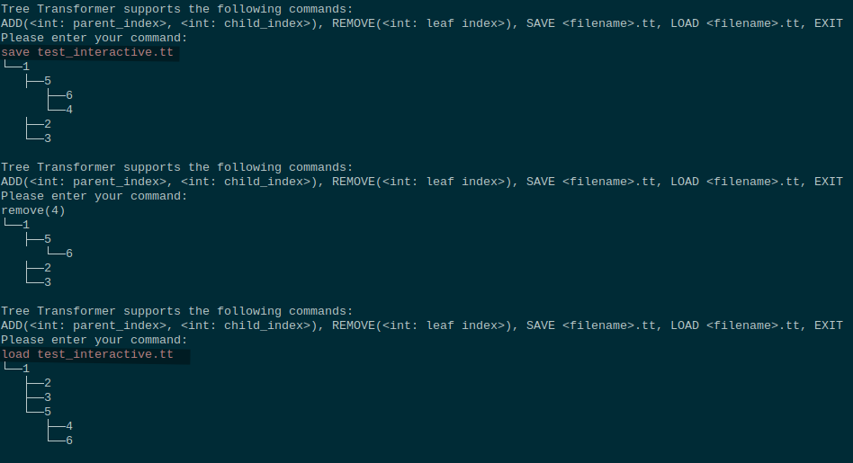

# Tree Transformer

## About

Tree tarnsformer is a program that computes neccessary transformations to be performed on one [general K-ary tree](https://en.wikipedia.org/wiki/Tree_(data_structure)), for it to become equal to another general tree. In addition to that, it supports **interactive command line interface** (CLI) that can be used to generate and transform trees in real time with ability to **save and load** generated trees into and from the CLI.

## Usage

In order to run Tree Transformer, you can use [TreeTransformer.jar](https://github.com/Voltorane/tree-transformer/blob/main/TreeTransformer.jar). General usage for that is either run it via:

`java -jar TreeTransformer.jar (<file1> <file2>)? (-h|--help)?`

or with

`chmod +x TreeTransformer.jar`

### Transformations from files

`./TreeTransformer.jar (<file1> <file2>)? (-h|--help)?`

<file1\> - file that contains the original tree definition

<file2\> - file that contains the desired tree definition, for which you want to get transformations

Tree definition is expected to be provided in the following format:

[parent, child][parent, child][parent, child]...

E.g.: [1,2][1,3][2,4]...

### Example

Content of file [**test_tree_1.txt**](https://github.com/Voltorane/tree-transformer/blob/main/resources/test_tree_1.txt) \
[1,2][1,3][3,4][1,5][5,6][5,7][7,8][2,9][2,10][10,15]

Content of file [**test_tree_2.txt**](https://github.com/Voltorane/tree-transformer/blob/main/resources/test_tree_1.txt) \
[1,2][1,3][3,4][1,6][6,5][5,7][7,9][2,10][10,12]

### Interactive mode

Running Tree Transformer without any arguments will result into a CLI mode.
In CLI mode user is able to generate Tree, that will be saved in program runtime memory, as well as save it to persistent memory and load back on demand.

`./TreeTransformer.jar`

CLI supports following instructions:

* ADD(<int: parent_index>, <int: child_index>) - add a node with <child_index\> as a child to the node with <parent_index\>. \
*Note: parent node of the first edge will be chosen as the root node of the tree!* 
* REMOVE(<int: leaf_index>) - remove a leaf node with <leaf_index\> from the tree \
*Note: removing last node will not result in an error, but will give an opportunity to make completely new tree* 
* SAVE <filename\>.tt - save currently generated tree to the <filename\> with extension **.tt**
* LOAD <filename\>.tt - load tree saved under <filename\>.tt onto current session \
*Note: current tree will be permanently removed!*
* EXIT - to exit the program

### Example

